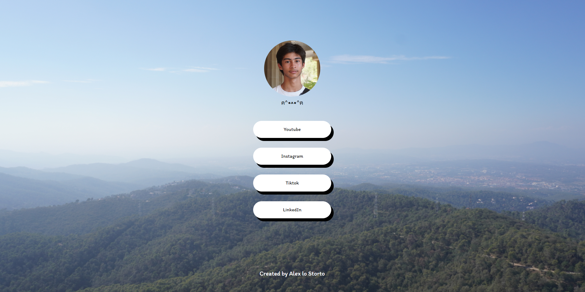
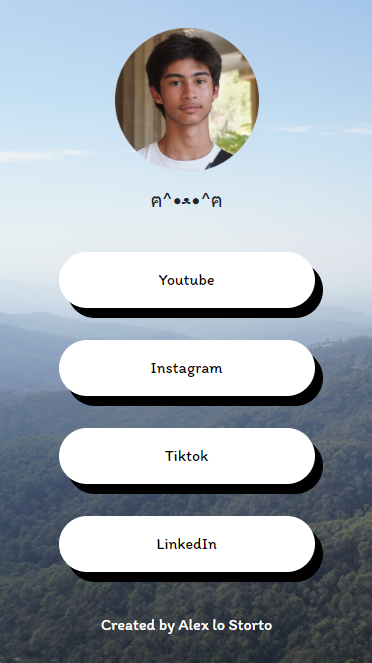

<h1 align="center">LinkMe</h1>

  <b>A page to display all your links!</b>

## ✨ Features

- Custom background
- Credits at the bottom
- Custom link buttons

## 📜 Credits

Everything is coded by Alex lo Storto

Licensed under the MIT License.
